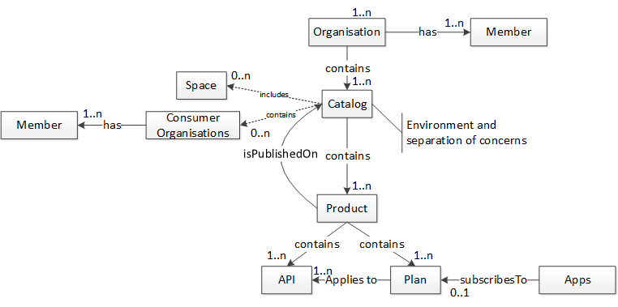
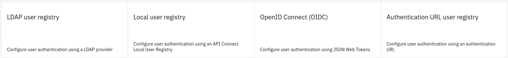
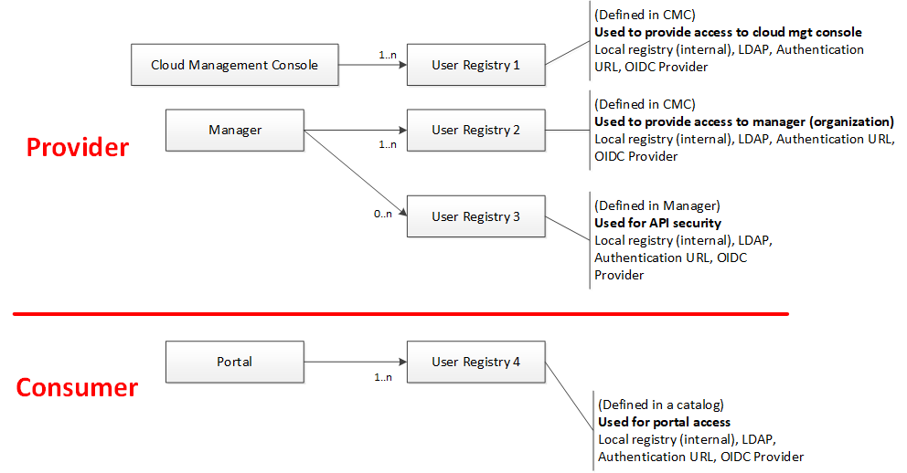
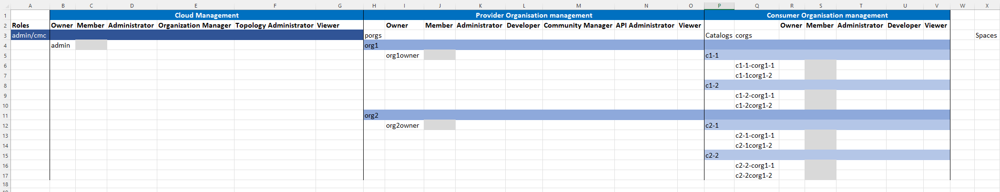

This paper is addressing user management in a broad sens in IBM API connect. It links overall to the broader topic of identity management.

It is work in progress

# The concepts in IBM API connect
The concepts behind user management is pretty simple in IBM API Connect.
It mixes the standard notion of Role Base Access Control and the notion of users defined in a user registry.
Users are splitted in three levels, users wit hresponsibilities on the API Cloud Management, on the provider organisations and the consumer organisations.
It also implements a very important notion of what we call *Delegated model*. This approach allows to better control users and their responsibilities. A user (admin1) can delegate responsibilities to another user (user1), but admin1 does not have user1's responsibilities or access (or view). Ths allows is a very good basis on the principle found in GDPR, the need to know basis.

Below the overall important concepts for user management.

## Types of users
We find basically two types of users:
* The Owners of the Cloud Management, of one or many provider organisations, of one or many consumer organisations (and the combinations)
* The Members of the Cloud Management, of one or many provider organisations, of one or many consumer organisations (and the combinations)

## Roles
Each user has a set of roles. 
You can create your own roles, but I'm not sure I would advise this considering the large number of default roles.

### Cloud level
* Administrator: Administers the admin organization
* Member: Minimum role
* Organization Manager: Manages API provider organizations
* Owner: Owns and administers the admin organization
* Topology Administrator: Administers the cloud topology
* Viewer: Views the admin organization
### Organisation level
* Developer: Authors API and product definitions
* Administrator: Administers the API provider organization
* Community Manager: Manages application developer communities
* Viewer : Views the API provider organization
* API Administrator: Manages the API product lifecycle
* Member: Minimum role
* Owner: Owns and administers the API provider organization
### Consumer Organisation level
* Owner: Owns and administers the app developer organization
* Administrator: Administers the app developer organization
* Developer: Builds and manages apps in the developer organization
* Member: Member of the app developer organization
* Viewer: Viewer of the app developer organization

## Delegated model
As mentionned before there is a delegated mode. So we can deduce that we have the following behavior:
The cloud admin user (by default admin) is creating:
* Members of the admin organisation (Cloud Management) with cloud level roles associated
* Owners of the provider organisations (porg)

The owner of a provider organisation is creating:
* Members of the provider organisation with organisation level roles associated
* Owners of the consumer organisations (corg)

The owner of a consumer organisation is creating:
* Members of the consumer organisation with organisation level roles associated

We can see here the delegated model and the chain of responsibilities.

Now that we have a better view of the user responsibilities, let's discuss of the user registries.

## User registries
A user registry can be of four types: 

| Type               | Description                                                                         |
|--------------------|-------------------------------------------------------------------------------------|
| LDAP               | Standard LDAP V3                                                                    |
| Local              | File based local to API Connect                                                     |
| OIDC               | Open ID Connect compliant IdP                                                       |
| Authentication URL | A simple URL based mechanism to integrate simply other IdP or existing Web Services |

You can create as many user registries that you need.

A user registry can point to the same definition of another one (for example same LDAP configuration) or not.

## Visibility of a User Registry

A user registry can be either public or private

# FAQ
1 - Should a user have other responsibilities on top of being the owner of the organisation?
This is a good question: 3 answers.
* The overall number of users is limited, so "mutualising" the user is a must, and having some roles/responsibilities at Cloud Management level for a porg owner or at porg level for a corg owner)  is a good idea. 
* You need a strong segreggation and you want to really control everything, so the owner has absolutely no responsibilities at the cloud level, so no role.
* You just want to provide a view of rhe cloud management (and for example let him know the other organisationations, or see the topology), you give him the role of Viewer.
Notice that in any case, being the owner of the organisation (porg or corg) he has all permissions within the organisation.

2 - What is really a member?
A member on its own is useless, it is just a definition of a user in a User Registry. A member in the product documentation is defined as minimum role, we can consider a member like a user without any role.
As soon as a member has one or many roles, it is more interesting to consider his/her role (or combined role).

3 - May I have more than one owner for a porg or corg?
No, but you can transfer ownership to another user.

When we have user registries 
The porg owner is hence defined in a user registry visible at the cloud level

# Other decision factors
## Environments
## Spaces

# Sample of model implementation

## Large entreprise
In a large entreprise the number of users is much greater than 14 (the number of roles). There are maybe more than one organisation, there are more than one person for each role (or combinaisons of roles), there are many consumer organisations.

## Small entreprise
In a smaln or medium entreprise 

## Compromises

# Usefull REST API invocation

# Other resources
[Another git hub entry](https://github.com/ADesprets/bluemix-labs/blob/master/Lab%20API%20-%20Manage%20your%20APIs%20with%20API%20Connect/README-V10.md#table-of-content "A reference document I wrote")